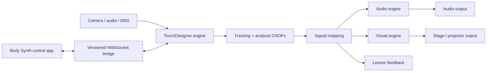

# Body Synth: TouchDesigner Backend Redesign

## Product decision

Body Synth becomes a session-based performance and learning instrument. TouchDesigner is the local real-time engine. The web application is the control surface and product experience.

This is broader than a visualizer:

- **Play** turns body and hand movement into sound and effects.
- **Practice** teaches guitar and bass using tracked hands, fretboard targets, and musical feedback.
- **Perform** combines live audio, movement, scenes, cues, visuals, and stage output.
- **Create** maps any tracked signal to an exposed sound, lesson, or visual parameter.

Users should not need to understand TouchDesigner networks. Advanced creators can eventually open or author engine packs, but the default product is outcome-first.

## What changes from the current prototypes

The current routes prove valuable pieces, but each route owns its own camera, tracking, render loop, and state.

| Current prototype | Product role | TouchDesigner responsibility | App responsibility |
| --- | --- | --- | --- |
| `/` body synth | Play | Audio playback/synthesis, FX graph, gesture signals | Mapping gestures, locking controls, transport |
| `/bass` | Practice | Camera, hand landmarks, optional pitch analysis | Lessons, theory, targets, scoring, progress |
| `/visualz` | Perform | Camera, segmentation, compositing, shaders, stage output | Scene selection, parameter controls, cues |
| `/ascii` | Scene/preset | ASCII render component | Style, theme, density controls |

The TypeScript fretboard theory and lesson rules remain product-domain code. Frame-rate-sensitive media work moves to TouchDesigner.

## Product model

### Session

A session is the top-level saved object. It contains:

- intent: play, practice, perform, or create
- instrument profile and tuning
- active engine modules
- scene and audio preset
- lesson, if any
- signal mappings
- cue list
- output configuration

The same session can move from rehearsal to stage without rebuilding the signal graph.

### Signals

Signals are normalized values produced by the engine. Examples:

- `audio.level`, `audio.low`, `audio.mid`, `audio.high`, `audio.peak`
- `body.center.x`, `body.center.y`, `body.area`, `body.velocity`
- `hand.left.x`, `hand.left.y`, `hand.left.open`, `hand.left.throw`
- `hand.right.x`, `hand.right.y`, `hand.right.open`, `hand.right.throw`
- `instrument.pitch`, `instrument.onset`, `instrument.confidence`
- `lesson.accuracy`, `lesson.streak`, `lesson.nextTarget`
- `midi.cc.*` and `osc.*`

Signals should use stable product names. The app must never depend on internal operator paths such as `/project1/base3/null7`.

### Parameters

Parameters are the safe controls a pack chooses to expose:

- audio: playback rate, filter, delay, reverb, distortion, pan, synth controls
- visuals: intensity, palette, feedback, displacement, particles, layer mix
- lessons: tempo, tolerance, target visibility, backing-track level
- output: blackout, brightness, resolution, fullscreen display

Every parameter has a type, range, default, label, and smoothing policy. TouchDesigner remains responsible for applying smoothing at engine rate.

### Mappings

A mapping connects a signal to a parameter through a deterministic transform:

```text
source -> normalize -> curve -> scale -> smooth -> target
```

Example:

```text
hand.right.y -> invert -> exponential -> 200..8000 -> 120ms -> audio.filter.frequency
```

The assistant may create or edit mappings, but the saved result is ordinary session data. No model is needed while a session is running.

## Runtime architecture



### TouchDesigner engine

TouchDesigner owns:

- camera and audio device selection
- body, hand, and instrument tracking
- high-frequency signal processing
- audio analysis and, where enabled, synthesis/effects
- visual rendering and feedback buffers
- MIDI and OSC device I/O
- stage, projector, NDI, Syphon, or Spout output
- engine telemetry and fault reporting

The engine is organized as stable top-level components:

```text
/body_synth
  /bridge
  /devices
  /tracking
  /analysis
  /mapping
  /audio
  /lesson
  /visuals
  /output
  /telemetry
```

Each component exposes deliberate custom parameters and null outputs. Internal networks remain replaceable.

### Body Synth app

The app owns:

- onboarding and device setup workflow
- session, scene, preset, and cue editing
- instrument profiles and fretboard theory
- lesson content, progress, and accounts
- a simple mapping editor
- engine health and performance UI
- optional natural-language editing

During the first prototype, the app can remain Next.js in a browser. A later desktop shell can launch and supervise TouchDesigner, manage local files, and provide a single application experience.

## Transport decision

Use the TouchDesigner Web Server DAT as a localhost WebSocket server for commands, state, and telemetry.

- Default URL: `ws://127.0.0.1:9980/body-synth`
- JSON control messages only; do not stream camera frames through this channel.
- TouchDesigner renders the initial preview and stage output in its own windows.
- Use a protocol version and engine capability handshake.
- Send full state after connecting, then revisioned patches.
- Coalesce continuous parameter changes; the UI does not need to send every pointer event.
- Keep OSC available for hardware and external applications, not as the browser's primary transport.

The bridge accepts only named Body Synth commands and parameter IDs. It must not expose arbitrary Python evaluation or arbitrary operator paths.

## Control protocol

The initial message families are defined in `src/lib/touchdesigner/protocol.ts`.

App to engine:

- `hello`
- `session.load`, `session.start`, `session.stop`
- `parameter.set`
- `cue.fire`
- `transport.set`
- `ping`

Engine to app:

- `welcome`
- `state.snapshot`, `state.patch`
- `telemetry.frame`
- `event`
- `error`
- `pong`

The engine rejects unsupported protocol versions and unknown parameter names with a structured error.

## Information architecture

The redesign uses one application shell instead of four disconnected pages.

### Home

- Resume recent session
- New Play, Practice, Perform, or Create session
- Engine and device status
- Packs and templates

### Session

- **Now**: large controls needed during use
- **Sound**: source, synth, effects, and audio mappings
- **Body**: tracking status, calibration, and gesture mappings
- **Learn**: instrument, lesson, target, and feedback settings
- **Scene**: visual pack, layers, palette, and visual mappings
- **Cues**: ordered changes for a song or lesson
- **Output**: display, resolution, recording, and broadcast routing

### Live mode

Live mode removes editing chrome and shows only transport, cue, safety, and performance controls. Blackout and audio stop remain permanently reachable.

## First vertical slice

Build one end-to-end session before moving every prototype.

### Body Echo session

Inputs:

- camera
- microphone or audio interface
- body segmentation
- two tracked hands

Mappings:

- right-hand height -> filter frequency
- left-hand horizontal position -> delay pan
- body velocity -> visual feedback amount
- audio onset -> visual pulse

Outputs:

- processed audio
- Aura + Echo visual scene
- engine telemetry in the app

Controls in the app:

- connect/disconnect engine
- select devices
- start/stop session
- enable or disable each mapping
- adjust mapping depth
- select palette
- fire blackout

Success criteria:

- reconnect without restarting the TouchDesigner project
- control round-trip below 50 ms on localhost
- stable 30 FPS minimum at 1280x720 on the development Mac
- no browser camera or microphone permission required
- saved session reloads to the same sound and scene state
- an engine failure leaves audio stop and blackout in a known safe state

## Migration sequence

### Phase 0: engine research

1. Upgrade TouchDesigner to a build compatible with the selected MCP tooling.
2. Install the MCP only for development and network authoring.
3. Validate camera, audio, MediaPipe, and Web Server DAT behavior on the target Mac.
4. Keep MCP control bound to localhost and out of the shipped product.

### Phase 1: bridge and Body Echo

1. Create the `/body_synth` TouchDesigner component hierarchy.
2. Implement the WebSocket handshake and parameter allowlist.
3. Rebuild Aura + Echo and the three gesture/audio mappings.
4. Add the Body Synth connection client and session controls.

### Phase 2: absorb the prototypes

1. Move the remaining Visualz modes and ASCII scene into engine packs.
2. Move Tone.js playback and effects into the TouchDesigner audio graph where practical.
3. Feed TouchDesigner hand landmarks into the existing fretboard lesson code.
4. Retire duplicate browser camera and tracking loops after parity is verified.

### Phase 3: product shell

1. Package the controller as a desktop app.
2. Add engine launch, update, crash recovery, and local project management.
3. Decide whether distribution targets licensed TouchDesigner users, a Derivative partnership, or a later owned runtime.

## Non-goals for the first release

- A general-purpose node editor
- Arbitrary TouchDesigner Python from the UI
- Cloud rendering of the live session
- A public pack marketplace
- Automatic generation of an entire show from one prompt
- Migrating the Apple AR teaching roadmap before the desktop session model is proven

## Distribution constraint

TouchDesigner is a practical development and professional-user backend, but TouchEngine currently requires each end user to have an eligible paid TouchDesigner or TouchPlayer license. Treat consumer distribution as a separate commercial decision. Do not make the session format dependent on `.toe` or `.tox` internals; the portable product model leaves room for a future owned runtime.

