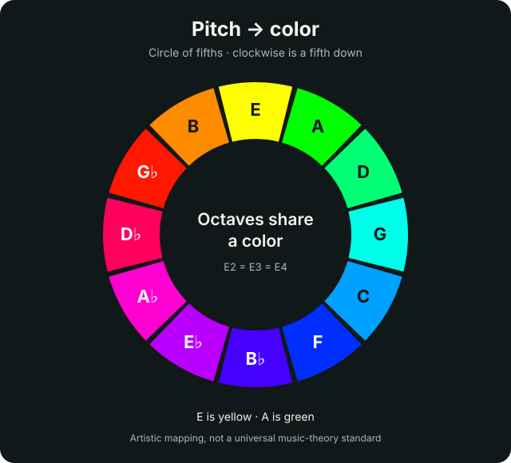

# fuzz

A local TouchDesigner scene where the pitch you play colors the camera image,
while audio level and plucks drive feedback and short displacement pulses.
Its local preview works independently. Projector alignment and display routing
belong to the separate [Projection Mapping project](../projection_mapping/README.md).

## Run the engine

Use **TouchDesigner 2025.33070 or newer**. That build introduced the Web Server
DAT's Local Address parameter ([release notes](https://derivative.ca/release/202533070/75035)).
Older builds cannot safely bind this server to loopback; the builder leaves
the bridge off and reports the required upgrade.

1. Open **[fuzz.toe](fuzz.toe)** from this folder. The complete network and
   callbacks are embedded; no script execution or MCP setup is needed.
2. Press **F1** for the local Fuzz output. Press **Esc** to return to the editor.
   This uses your camera image. If it is black, check `camera_in` has a working
   device and that the camera is uncovered. `OUT` is the final image;
   the `preview` Window COMP also provides a bordered local preview window.
3. Connect the Spark by USB and select it in `audio_in` → Device. Use a clean
   tone and play **one note at a time**. Fuzz detects pitch locally; no browser
   or pairing is needed. Otherwise it uses the default audio input.
   See the [Spark guide](../../docs/spark-pedal.md) for routing checks.
4. To also connect the trainer, in **Dialogs → Textport and DATs**, run:

   ```python
   print(op('/project1/fuzz').fetch('pairingCode'))
   ```

   Paste the code into the trainer's **TouchDesigner visuals** panel and connect
   to `ws://127.0.0.1:9980/body-synth`. It changes each time the project opens.
5. Song mode → Play sends the current chord and transport state; correctly
   detected chord tones trigger brief pulses. Stop clears the current pulse.

Opening this project activates camera/audio input and a paired, loopback-only
control server. Close the project to release its devices. Browser camera/audio
capture is independent and stops when its page is closed.

## Notes and colors



The colors follow an artistic circle-of-fifths palette: each clockwise step
is a fifth down, **E is yellow**, and **A is green**. This is a visual
mapping, not a universal music-theory color standard. Octaves share a color;
E2 and E4 are both E. The detected frequency determines the note, independently
of the trainer's selected song chord.

On `/project1/fuzz` → **Pitch Color**, **Pitch color amount** (`Tint`) ranges
from 0 to 1 and defaults to 1. Set it to 0 for the natural camera colors.
After a note ends, its tint holds briefly and fades back to the natural image.
Open the `pitch_monitor` viewer to see the detected note and Hz; this label is
local and is not included in `OUT` or the projector feed. The `PITCH` CHOP
exposes frequency, MIDI note, pitch class, confidence, active state and RGB
channels for inspection.

This estimates one pitch at a time from 65–1200 Hz. Distortion, echo, chord strums, backing
tracks and looper playback can confuse the detector. Start with clean isolated
notes before adding effects.

## Rebuild or export

To rebuild while this repository's project is open, run in the Textport:

```python
FUZZ_DIRECTORY = project.folder
exec(open(FUZZ_DIRECTORY + '/fuzz_build.py').read())
```

For a different project, set `FUZZ_DIRECTORY` to this checkout's
`touchdesigner/fuzz` directory. The builder only changes `/project1/fuzz`,
preserves visual settings, and restarts the bridge. Reconnect afterward.
Older builds can rebuild standalone visuals by setting
`FUZZ_BRIDGE_ENABLED = False` before running the script.

Keep ordinary working saves private. Incremental saves and backups in this
folder are ignored; only the audited `fuzz.toe` is tracked. Before replacing
that shared file:

1. Call the following in Textport, then save a separate staging `.toe`:

   ```python
   b = op('/project1/fuzz')
   b.op('audio_in').par.active = False
   b.op('pitch_callbacks').module.reset()
   b.op('PITCH').cook(force=True)
   b.op('bridge_callbacks').module.prepare_for_export(b.op('bridge'))
   b.op('camera_in').par.device.val = ''
   b.op('camera_in').par.device.expr = "me.par.device.menuNames[0] if me.par.device.menuNames else ''"
   ```

   Audio capture is paused and pitch diagnostics are neutralized before saving.
   The bridge stays off until reopening; pairing code, authenticated clients,
   hit pulse, transport and session are cleared. Check any other device fields
   for machine-specific identifiers before sharing.
2. Use Derivative's [toeexpand](https://docs.derivative.ca/Toeexpand) on the staging file and
   remove **every `.ts` entry** from its `.toe.toc`. These are cached CHOP
   samples; include pitch diagnostics as well as audio/trigger caches.
   Restore `audio_in`'s Active setting in this expanded staging copy; preserve
   the remaining operator definitions (`.n` and `.parm`).
3. Run [toecollapse](https://docs.derivative.ca/Toecollapse) on the same staging
   filename. Both tools ship under the application's `Contents/MacOS` on macOS.
4. Expand the result again and inspect it: no cached `.ts` files, prior pitch
   readings in other CHOP data, saved device IDs, local paths, or credentials.
   Storage appears as hex-encoded pickle
   payloads in `.n` files; inspect opcodes with `pickletools`, never execute
   an unknown pickle. The `dict` and `idict` pairing values must be `None`,
   and `fuzzClients` must be empty. Raw text searches alone miss storage.
5. Reopen and verify output, fresh pairing, loopback binding, and operator
   errors before copying the checked artifact to `fuzz.toe`.

TouchDesigner's [storage startup values](https://docs.derivative.ca/OP_Class)
prevent the pairing code from being saved. Removing sample caches is a
separate step: ordinary `.toe` saves can contain recent audio samples and pitch
readings. The detector's bounded audio history lives in Python module memory,
not saved operator storage.

## Controls and signals

| Control | Range / default | Effect |
| --- | --- | --- |
| Amount | 0–1 / 0.5 | Scales audio and note-hit displacement |
| Feedback | 0–0.98 / 0.9 | Trail retention, mildly modulated by input level |
| Blackout | Off by default | Makes the preview and shared final image black while the internal scene keeps running |

| Signal | Source | Effect |
| --- | --- | --- |
| `PITCH` | Local pitch detector fed directly by `audio_in` | Note color, confidence and frequency |
| `ONSET` | RMS slope through a trigger envelope | Displacement burst |
| `AUDIO_LEVEL` | Smoothed RMS; Spark selected when present | Trail retention |
| `CHORD` | Authenticated `song.chord` and `note.hit` messages | Song state and a hit pulse that decays over 250 ms; does not choose the color |

The camera sits behind the faded feedback image so an opaque camera frame
cannot erase the entire trail. Audio visuals continue without the app or when
Song mode is stopped. The final authenticated client disconnect also clears
the hit pulse and song transport state.

## Connection and security

The Web Server DAT listens on **127.0.0.1 only**. It accepts the `/body-synth`
WebSocket path and requires a version-1 `hello` with the local pairing code
before commands. Welcome and a complete state snapshot confirm connection.

Only the three controls above, song chord/hit events, transport, and heartbeat
messages are accepted. The bridge validates types, finite numbers, ranges,
and an 8 KB message limit. It never evaluates app-supplied Python, files, or
operator paths. HTTP requests expose no state. This runtime bridge is separate
from the development MCP on port 9981.

The public HTTPS trainer may be unable to open a plain local WebSocket in
some browsers. If connection is blocked, use the locally served trainer; do
not disable browser security. See the trainer's connection panel for status.

## Local preview and optional projector feed

`preview` is a bordered Window COMP showing `OUT` on this computer.
Fuzz owns the camera/audio effect and its local controls; projector calibration
and display routing live in
[projection_mapping.toe](../projection_mapping/projection_mapping.toe).

For the separate mapper to use Fuzz, keep both projects open on the same Mac.
The `local_texture` Syphon Out TOP publishes the final `OUT` image under the
sender name **`body-synth-fuzz`**. Select that source in the mapper following
its [setup guide](../projection_mapping/README.md). The image is shared locally;
the trainer's WebSocket still carries only chord, hit, transport, and control
messages. The mapper is optional for local Fuzz use and guitar pairing.

## Validation

Run Python regression tests with NumPy available (included with TouchDesigner):

```sh
python3 -m unittest discover -s touchdesigner/fuzz -p 'test_*.py' -v
```

All 40 Python tests pass, including pitch, harmonics, silence, stale input,
channel changes, and bridge security. Native tests produced yellow pixels for
E2 (82.41 Hz), green for A2 (110 Hz), and natural colors after silence. The
32-operator project reopened at 1280×720 without errors; rebuilding preserves the
color amount. The saved export contains neutral pitch diagnostics, no cached
audio, and no pairing code. Earlier checks verified separate-process Syphon
transfer and trainer control acknowledgments. Real Spark input, guitar response,
and physical projector alignment still require hardware testing.
